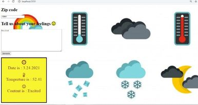

# Project : Weather-Journal App Project
## By  Gina ayad

## Table of contents

- [overview](#overview)
- [How to run](#Run)
- [install](#install)
- [output](#output)
- [Copyright and License](#copyright-and-license)
___
## overview

###### This project creates an asynchronous web app that uses Web API [OpenWeatherMap website](https://openweathermap.org/) and user data to dynamically update the UI supplying the user by *the Date* and *Tempreture* and *user feeling* according to what user added before  , this project is a part of the Udacity's [ Front End Developer Nanodegree ](https://www.udacity.com/course/front-end-web-developer-nanodegree--nd0011).
___
# Run

- node server.js on terminal
- it runs on local server of port:3000 on browser
___
# install

-Express should be installed
-body-parser package should be installed
-cors should be installed
___
# output 

____
## Copyright and License

- supplied without rights information contributed by [Udacity](http://www.udacity.com).
